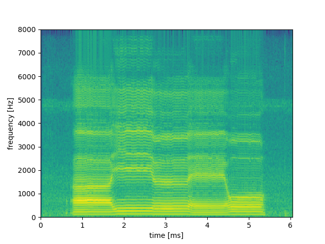

# Exercise 4

## 「あいうえお」のスペクトログラムを図示せよ．横軸が時間，縦軸が周波数，各ピクセルの色（もしくは濃淡）が振幅を表すようにすること．用いた窓関数の種類，長さ，シフト長についても説明すること．また，スペクトログラムの縦軸・横軸の意味についても詳しく説明すること．

### Color

The color in the spectrogram represents the pressure of each frequncy. The yellow menas higher pressure while the blue means lower. 

Blue $\rightarrow$ Yellow

### Window function

The window function used was the Hamming Window.

The window function used in our program is the [Hamming Window](https://stackoverflow.com/questions/5418951/what-is-the-hamming-window-for) function. When we attain our sine waves from a fourier transformation, we can observe a sharp spike. However, this will be unfortunately accompanied by noise, which can make the waves slightly unclear. This is where the hamming window comes into play. This function will reduce this noise, making the spikes clearer to observe while reducing the extra noise surroudn the spikes. 

### Frame size

The frame size was 512 samples.

This works with the hamming function as the sample size (512 samples). We maintain a sample size of powers of 2 to optimize the performance of our FTT computations. 

### Shift size

the shift size was 160

The shift size allows each frame within our spectrogram to have smoother transitions between one another. This is done by giving some overlaps between each subsequent frame, instead of forming sudden breaks.

### X-axis Y-axis

Each frame represents a time segment in the audio clip. Each segment is 10ms long, as defined by the shift size, and shows how the frequencies evolve over time. 

Each frame's fourier transform reveals the frequency components of each frame in the audio clip. 