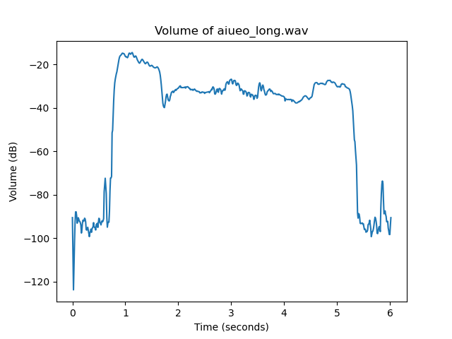
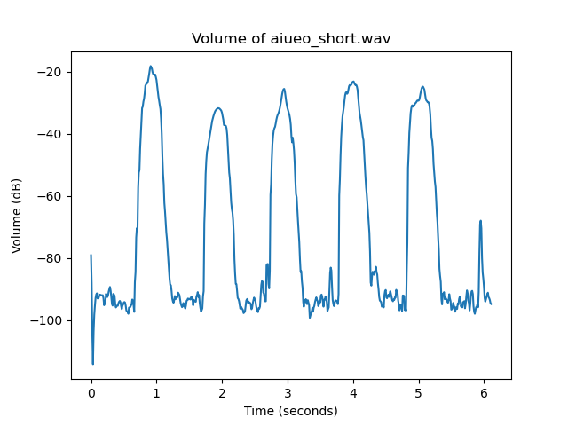

# Exercise 06

## 音量に対して適切な閾値を設定し，発話区間（話している区間）を自動で抽出せよ．発話区間の開始と終了の時間情報を（コマンドプロンプト，ターミナルを含む）何らかの形式で表示できればよい．

### aiueo_long.wav



Terminal output is the following...

```bash
❯ python plot_volume.py
Speach started at: 0.75 seconds
Speach ended at: 5.36 seconds
```

### aiueo_short.wav



Terminal output is the following...

```bash
❯ python plot_volume.py
Speach started at: 0.77 seconds
Speach ended at: 1.09 seconds
Speach started at: 1.82 seconds
Speach ended at: 2.08 seconds
Speach started at: 2.79 seconds
Speach ended at: 3.06 seconds
Speach started at: 3.83 seconds
Speach ended at: 4.15 seconds
Speach started at: 4.86 seconds
Speach ended at: 5.20 seconds
```