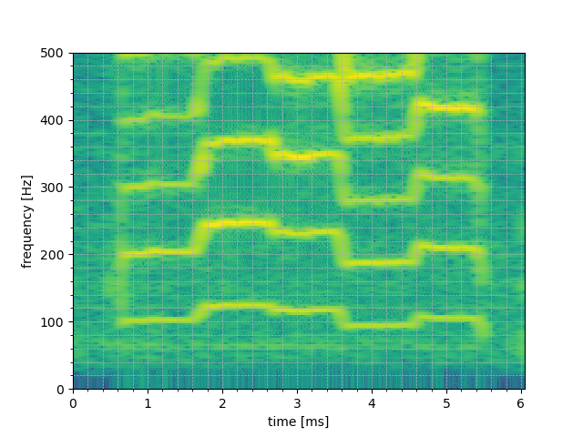
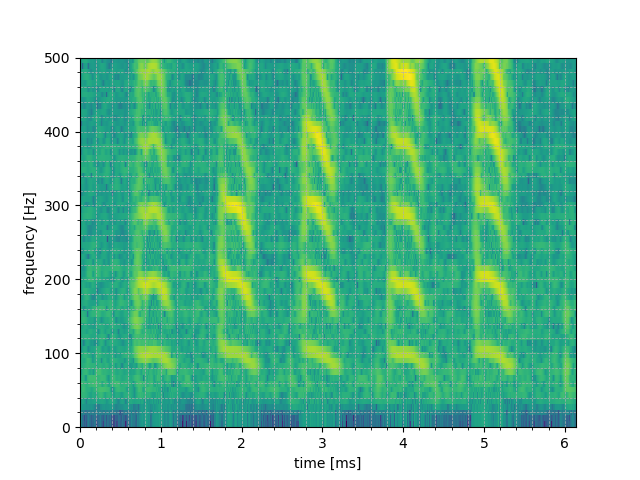

# Exercise 07

## 2 種類の「あいうえお」のスペクトログラムに対して，その基本周波数をスペクトログラム上で確認せよ．各母音の基本周波数がどれくらいの数値なのかを説明すること．ただし，スペクトログラムを周波数方向に拡大する必要があることに注意すること．

Looking at the first spectrogram, we can see that the approximate value of the fundamental frequencies of aiueo are:
- a : 100Hz
- i : 130Hz
- u : 115Hz
- e : 95Hz
- o : 110Hz

As for the second spectrogram, we can see that it is a bit different from the previous one. However, still pretty similar.
- a : 100Hz
- i : 105Hz
- u : 110Hz
- e : 95Hz
- o : 110Hz
